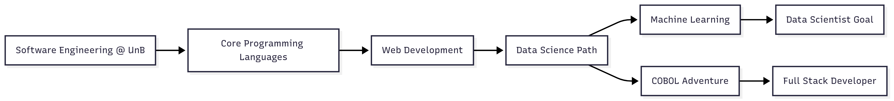

# Hey there! 👋 I'm G16C

<div align="center">
  


</div>

## 🎓 About Me

I'm a **Software Engineering** student at **Universidade de Brasília (UnB)**, passionate about building robust applications and diving deep into the world of data science. Currently based in Brasília, I'm on a journey to transform data into meaningful insights!

```python
class G16C:
    def __init__(self):
        self.name = "G16C"
        self.education = "Software Engineering @ UnB"
        self.location = "Brasília, Brazil"
        self.current_focus = "Data Science"
        self.dream_language = "COBOL"  
        
    def get_current_languages(self):
        return ["Python", "Java", "C++", "JavaScript", "CSS", "HTML"]
        
    def future_goals(self):
        return {
            "short_term": "Master data science fundamentals",
            "medium_term": "Learn COBOL (because why not?)",
            "long_term": "Become a data scientist extraordinaire"
        }
```

## 🛠️ Tech Stack

<div align="center">

### Languages I Love


### Web Technologies


### Learning Next


</div>

## 📊 GitHub Stats

<div align="center">
  


</div>

## 🎯 Current Goals

- 🐍 **Mastering Python** for data science applications
- 📊 **Learning data analysis** with pandas, numpy, and matplotlib
- 🤖 **Exploring machine learning** algorithms and frameworks
- 🏛️ **Planning to learn COBOL** (because legacy systems need love too!)
- 🎓 **Excelling in Software Engineering** at UnB

## 🌱 Learning Journey




## 💡 Fun Facts

- 🎓 Studying at one of Brazil's top universities (UnB)
- 🌍 Based in Brasília, the heart of Brazil
- 📚 I want to learn COBOL because I believe in understanding computing history
- 🎯 My goal is to bridge traditional programming with modern data science
- 🚀 Always excited about new technologies and challenges

## 📫 Let's Connect!

<div align="center">

[](https://linkedin.com/in/yourprofile)
[](mailto:your.email@gmail.com)
[](https://your-portfolio.com)

</div>

## 🐍 Contribution Graph


---

<div align="center">
  
**"The best way to predict the future is to create it."** - Peter Drucker


</div>
